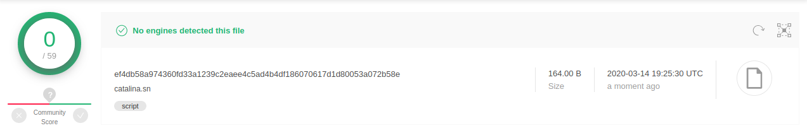
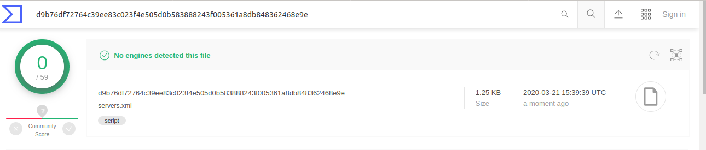
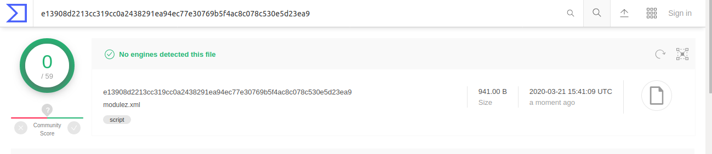
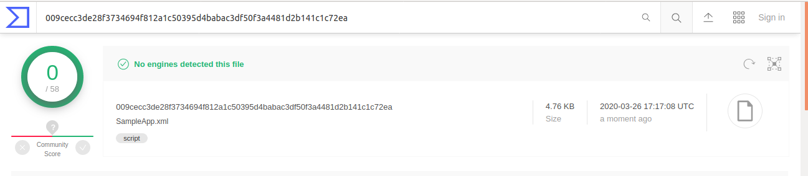

#JAVA SHEBANG SAMPLES

Some samples that uses java scripts for red teaming. Uploaded to VT to check out detections:

catalina.sn:

servers.xml:

modulez.xml:

SampleApp.xml:

##Sample List
catalina.sn :- cmd echoer, use stickybits to escalate priveleges. no rshell
servers.xml  :- bind a TCP shell listening on port 6666.
modulez.xml :- client for TCP rshell. pass the ip and port in cmdline
SampleApp.xml :- Http listener shell. Default password is trebuchet. Usage example:
                 GET : curl -X GET "http://127.0.0.1:8089/examples/Sampleappz.jsp?huskarl=trebuchet&paladin=whoami"
                 POST : curl -X POST "http://127.0.0.1:8089/examples/Sampleappz.jsp" -d "huskarl=trebuchet&paladin=whoami"

The yara rules to detect these samples are listed in detection.
